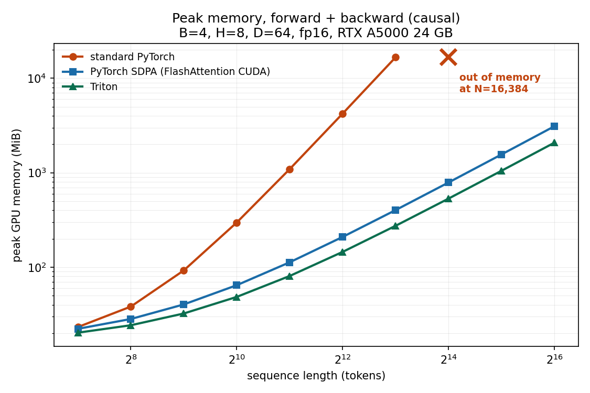
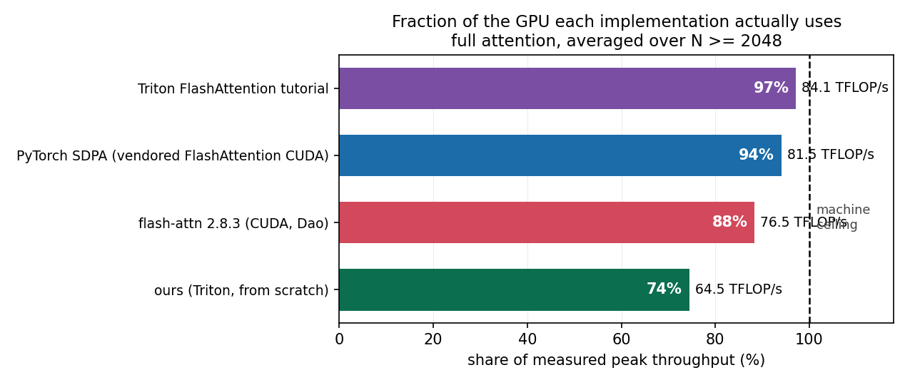
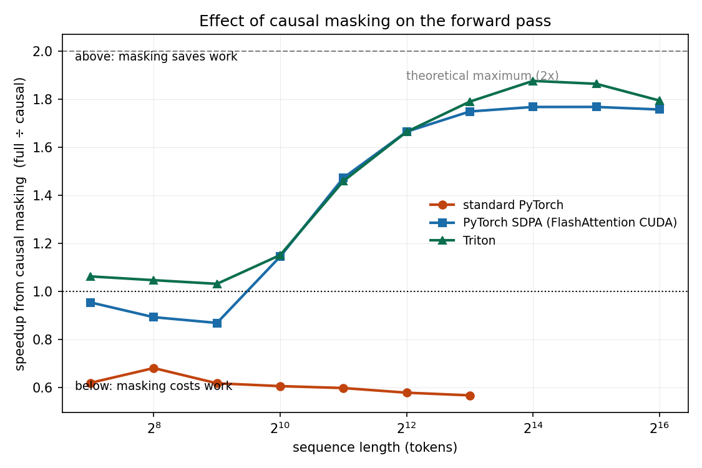
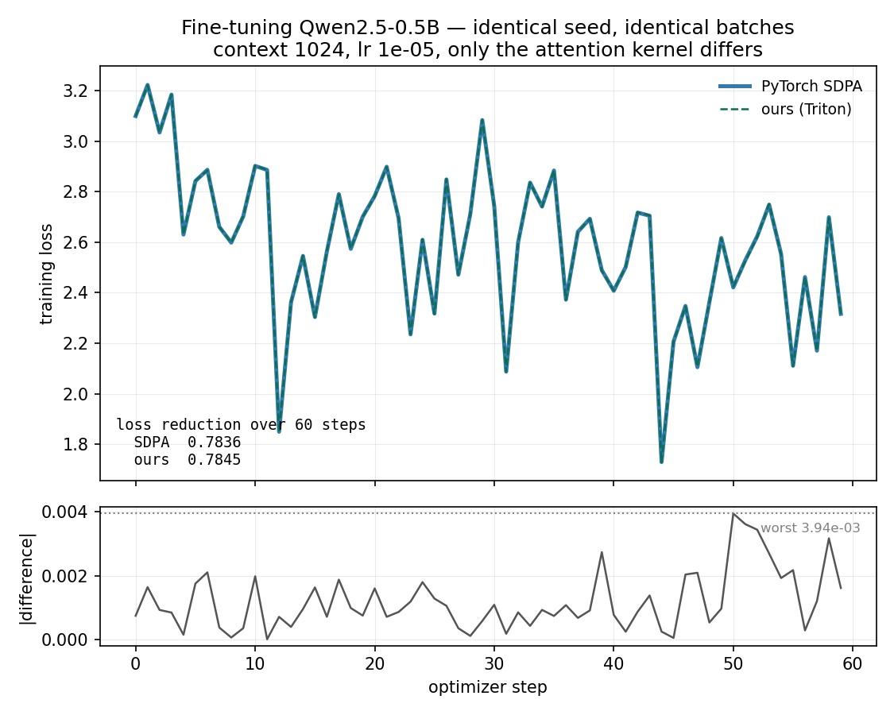

<div align="center">

# FlashAttention-2 from scratch

**A Triton implementation written from first principles — then dropped into a real pretrained model to see whether it holds up.**

409 tests · fp16 & bf16 · causal · grouped-query · variable lengths · forward & backward · drop-in for 🤗 `transformers`

[**Read the write-up →**](docs/writeup.md) · [**Interactive explainer →**](viz/online-softmax.html) · [Raw measurements →](benchmarks/results/)

</div>

---

|  | standard PyTorch | **this kernel** |
| --- | --- | --- |
| memory scaling, measured | $N^{1.94}$ | $\mathbf{N^{0.91}}$ |
| peak memory at 8k context | 16,656 MiB | **274 MiB** — 61× less |
| longest context on a 24 GB card | 8,192 | **65,536** |
| perplexity on a real 0.5B model | 13.0761 | **13.0763** |
| share of the GPU's measured peak | — | 74% *(best available: 97%)* |



Standard attention runs out of memory at 16k tokens. The same mathematics, tiled,
reaches 64k in 2 GB. That is a change in **exponent** — 1.94 against 0.91 — not a
better constant.

---

## The idea, in one identity

Softmax needs a row's maximum before it can normalize anything. FlashAttention
never sees a whole row — so it keeps a running maximum and repairs the past when
a larger one arrives:

$$\alpha^{(t)} = e^{\,m^{(t-1)} - m^{(t)}}, \qquad \ell^{(t)} = \alpha^{(t)}\ell^{(t-1)} + \textstyle\sum_j e^{\,s_j - m^{(t)}}$$

Every stale term is wrong by the *same* factor, so one multiplication corrects an
arbitrarily long history. The state is three numbers per query row, whatever the
sequence length — which is where linear memory comes from.

> 🔬 **[Step through it on real numbers →](viz/online-softmax.html)** — eight keys,
> the largest arriving last so the correction factor has to do visible work.

---

## Results

One RTX A5000 (24 GB, sm_86), fp16, PyTorch 2.4.1, Triton 3.0.0. Everything below
is reproducible from [`benchmarks/`](benchmarks/).

### Speed — including the part that isn't flattering



Four implementations, one GPU, one measurement harness. This kernel reaches **74%
of what the hardware can actually deliver**; PyTorch's SDPA (confirmed by
profiler to be a vendored FlashAttention CUDA kernel) reaches 94%, Tri Dao's
`flash-attn` 88%, and **Triton's own tutorial kernel 97% — beating both CUDA
implementations**.

That reframes the gap usefully: it is not Triton versus CUDA. A well-written
Triton kernel saturates this machine, so the remaining 1.3× is *this
implementation*. The [roofline analysis](benchmarks/roofline.py) locates it —
compute-bound above N=256, using 1–2% of available bandwidth, so the exponential
and the causal mask sit on the critical path instead of hiding behind the tensor
cores.

The denominator is **measured** (a large cuBLAS fp16 matmul), not the datasheet's
111 TFLOP/s — that figure assumes fp16 accumulation and would have flattered
every number here by 28%.

### Causal masking does opposite things to the two implementations



Letting each token see only the past makes standard attention **1.75× slower** —
it builds a mask, applies it, and performs the work anyway. It makes this kernel
**1.79× faster**, because whole blocks above the diagonal are never loaded.

### Correct inside somebody else's model

The kernel registers as a `transformers` attention implementation, so
**Qwen2.5-0.5B** runs on it unmodified — including its grouped-query attention
(14 query heads over 2 KV heads).

| | PyTorch SDPA | **this kernel** |
| --- | --- | --- |
| perplexity, WikiText-103 test (299k tokens) | 13.0761 | **13.0763** |
| loss reduction over 60 fine-tuning steps | 0.7836 | **0.7845** |
| attention calls recorded | 0 | **3,504** |

The third row is the one that makes the first two mean anything: a silent
dispatch failure would produce *perfect* parity, because the reference would have
run twice. 3,504 is exactly 24 layers × 146 batches.



Identical seed, identical batches, only the attention kernel differs. The
residual panel keeps the claim honest — two noisy curves drawn on top of each
other always look identical.

---

## Using it

```bash
pip install -e .
```

```python
from flash_attn_scratch.autograd import flash_attention

out = flash_attention(q, k, v, causal=True)     # (B, H, N, D), fp16 or bf16
```

```python
from flash_attn_scratch.hf import register
register()

model = AutoModelForCausalLM.from_pretrained(
    "Qwen/Qwen2.5-0.5B", dtype=torch.bfloat16, attn_implementation="flash_triton"
)
```

> The package is `flash_attn_scratch`, not `flash_attn` — Tri Dao's library owns
> that import name, and colliding with it breaks both.

| supported | |
| --- | --- |
| dtypes | fp16, bf16 |
| attention | multi-head, grouped-query, multi-query |
| masking | causal, full |
| lengths | square, and $q_{len} \neq kv_{len}$ (KV-cache decoding, chunked prefill) |
| head dims | 16, 32, 64, 128 |
| passes | forward, backward, `torch.autograd.Function` |

**Not supported, and why:**

- **Arbitrary attention masks.** A dense additive mask is itself $N \times N$ —
  32 GB at 64k context — which would negate the entire memory result. Causal,
  sliding-window and ALiBi patterns are index-computable and need no such tensor;
  the reference implementations don't support dense masks either, for the same
  reason. Batches must therefore be padding-free.
- **Attention dropout.**
- **Autotuning.** Block sizes come from a heuristic; the roofline quantifies what
  tuning could recover (~1.3×).
- Causal attention requires at least as many keys as queries.

---

## How it's built

`triton_fwd.py` holds seven kernels. Six are unreachable from the public API, and
that is deliberate — they are the derivation, each isolating one idea with its own
tests, so a failure names the concept that broke rather than "attention is wrong".

| kernel | what it isolates |
| --- | --- |
| `_copy_q_kernel` | grid launch, strided tile loads, boundary masking — no arithmetic |
| `_qk_tile_kernel` | one tile of $QK^\top$; tensor cores, fp32 accumulator |
| `_softmax_tile_kernel` | safe softmax over a single tile; $-\infty$ masking |
| `_running_max_kernel` | the running maximum $m_i$ across blocks |
| `_running_sum_kernel` | the correction factor $\alpha$ |
| `_running_output_kernel` | the output accumulator — online softmax complete |
| `_fwd_kernel` | the assembled forward pass |

### Correctness

Checked against two independent references — a transparent fp32 baseline and
PyTorch's SDPA. Beyond example comparison, the suite asserts *properties*:

- **Block-size invariance** — any tiling must give the same answer.
- **Causality** — perturbing a future token leaves earlier outputs *bit-identical*.
- **Incremental decoding** — one token at a time against a growing cache equals a
  single full pass.
- **Numerical extremes** — scores in the hundreds, where an unsafe softmax
  overflows to `inf` or underflows its denominator to zero.
- **Group accumulation** — under GQA a shared KV head's gradient must be the *sum*
  over its query group; an error there is a silent factor of `GROUP_SIZE`.

Tolerances are calibrated by measuring each dtype's own error floor (fp16 ≈ 0.002,
bf16 ≈ 0.013) and sitting 6–10× above it, rather than picked by feel.

**Why there is no `gradcheck`:** it requires float64, and `tl.dot` reaches tensor
cores only in fp16/bf16. Gradients are checked against autograd through the fp32
baseline instead, which is itself verified against SDPA.

```bash
pytest                  # 409 tests; gpu-marked ones skip without CUDA
pytest -m "not slow"    # skips long-context cases
```

First run on a machine takes ~190 s, every later run ~12 s. The gap is **kernel
compilation, not execution** — Triton builds a binary per `constexpr` combination
and specializes integer arguments on `x % 16 == 0` and `x == 1`. On an ephemeral
machine, keep the cache: `export TRITON_CACHE_DIR=/workspace/.triton_cache`.

### Reproducing the measurements

```bash
python benchmarks/bench_attention.py            # sequence-length sweep
python benchmarks/roofline.py --measure-only    # hardware ceilings (needs GPU)
python benchmarks/roofline.py                   # roofline analysis
python benchmarks/compare_implementations.py    # four-way comparison
python examples/perplexity_parity.py            # Qwen2.5-0.5B parity
python examples/long_context_training.py curves # A/B loss curves
```

---

## Next

- **Fuse dK and dV**, sharing recomputed probabilities instead of rebuilding twice.
- **`exp2` over `exp`**, folding $\log_2 e$ into the scale — Ampere has a hardware
  `ex2.approx.f32` and no hardware `exp`.
- **Split the causal loop** so sub-diagonal blocks skip the elementwise mask.
- **Autotune block sizes** against the measured roofline.
- **Sequence-length vectors** for padded batches — $O(B)$, unlike a dense mask.
- **A long-horizon time-series testbed** as a second long-context workload.

## Prior art

The algorithm is from [FlashAttention](https://arxiv.org/abs/2205.14135) and
[FlashAttention-2](https://arxiv.org/abs/2307.08691) (Dao et al.). Benchmarked
here against [Dao-AILab/flash-attention](https://github.com/Dao-AILab/flash-attention)
and Triton's [tutorial kernel](https://github.com/triton-lang/triton/blob/main/python/tutorials/06-fused-attention.py).
Nothing was copied from either — this is a from-scratch derivation, which was the
point.

## License

MIT — see [LICENSE](LICENSE).
