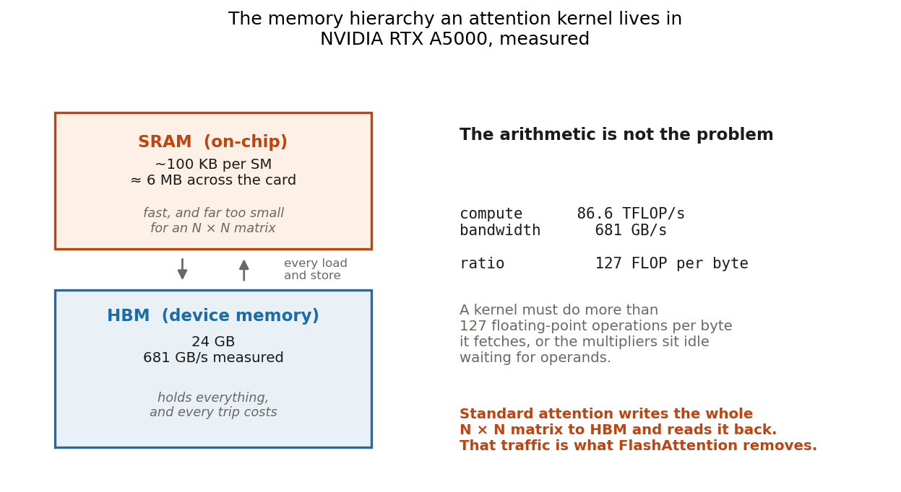
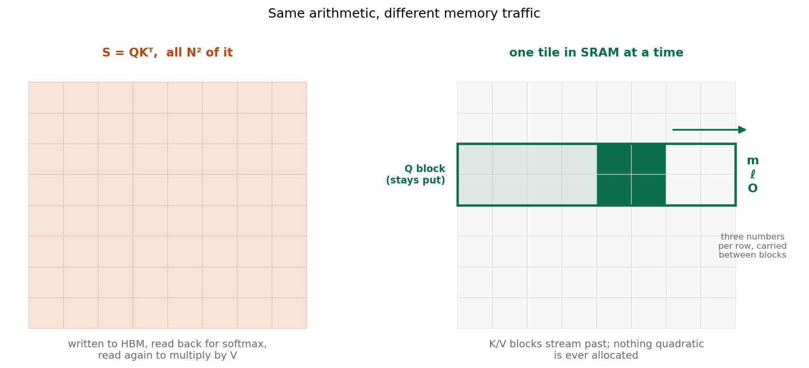

# The bottleneck is the bus

*Writing FlashAttention-2 from scratch, and measuring what it actually buys.*

---

Attention is four lines of maths:

$$S = \frac{QK^\top}{\sqrt{d}}, \qquad P = \mathrm{softmax}(S), \qquad O = PV$$

Written that way it looks like a compute problem. It is not. It is a plumbing
problem, and the plumbing is the reason a 2022 paper about *memory movement*
reshaped what context lengths language models could reach.

This is a walk through implementing FlashAttention-2 as a Triton kernel from
first principles — the algorithm, the one identity everything hinges on, and
then the measurements, including the ones that came out worse than hoped.

---

## 1. Why the matrix is the problem

$S$ is $N \times N$. At a 4,096-token context with 8 heads and a batch of 4, in
fp16, that single tensor is **1 GB**. You need more than one of it — the masked
copy, the exponentiated copy, whatever autograd retains for the backward pass.
Double the context and every one of those quadruples.

That is the familiar complaint, and it is only half the story. The other half:

A GPU is two machines bolted together. There is a very fast one with almost no
memory — roughly 100 KB of SRAM per streaming multiprocessor, about 6 MB across
the whole card — and a very large one that is comparatively slow to reach. On
the RTX A5000 used throughout this project, I measured **86.6 TFLOP/s** of fp16
compute against **681 GB/s** of memory bandwidth.

Divide them and you get the number that governs everything: **127 floating-point
operations per byte fetched**. A kernel that does less arithmetic per byte than
that leaves the multipliers idle, waiting for operands. It does not matter how
elegant the maths is; the silicon is stalled.

Standard attention builds $S$ in the large slow memory, reads it back to
normalize it, and reads it a third time to multiply by $V$. The arithmetic is
incidental. The kernel spends its life walking to the warehouse.

## 2. Never build the matrix

FlashAttention's idea is to hold a block of queries in the fast memory and stream
key/value blocks past it, so that only a small tile of $S$ exists at any instant.

Both sides of that picture compute exactly the same numbers. The left one stores
all of them; the right one stores a tile, uses it, and throws it away.

There is an obvious objection, and it is the whole difficulty: **softmax needs
the entire row before it can produce any output.**

$$p_{ij} = \frac{e^{s_{ij} - m_i}}{\sum_k e^{s_{ik} - m_i}}, \qquad m_i = \max_j s_{ij}$$

The maximum subtraction is not cosmetic. Without it $e^{s}$ overflows fp32 above
$s \approx 88$, and attention scores routinely exceed that. But you cannot know
the row maximum until you have seen the row — and the entire point is that you
never do.

## 3. The one identity

Suppose you have processed some blocks and hold a running maximum $m^{(t-1)}$
and a running denominator

$$\ell^{(t-1)} = \sum_{j \in \text{seen}} e^{\,s_j - m^{(t-1)}}$$

Now a block arrives containing a score larger than anything so far, so
$m^{(t)} > m^{(t-1)}$. Everything you have accumulated is now wrong: it was
exponentiated against a maximum that has since been superseded.

You do not recompute. You observe that

$$e^{\,s_j - m^{(t)}} = e^{\,s_j - m^{(t-1)}} \cdot e^{\,m^{(t-1)} - m^{(t)}}$$

Every stale term is wrong by **exactly the same factor**. So one multiplication
repairs the entire history, no matter how long it is:

$$\boxed{\;\alpha^{(t)} = e^{\,m^{(t-1)} - m^{(t)}}\;}$$

$$\ell^{(t)} = \alpha^{(t)}\,\ell^{(t-1)} + \sum_{j \in \text{block}} e^{\,s_j - m^{(t)}}$$

$$O^{(t)} = \alpha^{(t)}\,O^{(t-1)} + P^{(t)}V^{(t)}$$

That is FlashAttention. Everything else is engineering.

Note what the state consists of: for each query row, a maximum, a sum, and an
output vector. **Three quantities, independent of sequence length.** That is
where linear memory comes from — not from cleverness about the matrix, but from
the fact that a summary of arbitrarily many past keys can be retroactively
corrected in constant time.

Two details worth keeping:

- $\alpha \in (0, 1]$ always, since $m$ only ever grows. Rescaling shrinks past
  contributions; it can never overflow.
- $\ell \geq 1$ always, because the row-maximum term contributes $e^0$. The final
  division needs no guard against zero.

> **[Watch it happen →](../viz/online-softmax.html)** — an interactive walkthrough
> on eight real keys, where the largest score deliberately arrives last so the
> correction factor has to do visible work.

## 4. Backward, without storing anything

Training needs gradients, which need $P$ — the very matrix we refused to build.

The standard answer is recomputation: rebuild each tile of $P$ on the fly. That
needs the softmax statistics, and here the second nice identity appears. Instead
of saving $m$ and $\ell$ separately, save

$$L_i = m_i + \log \ell_i \qquad\Longrightarrow\qquad p_{ij} = e^{\,s_{ij} - L_i}$$

One fp32 number per query row reconstructs any probability, with no division. At
$N=4096$, storing $P$ costs 32 MB per head; storing $L$ costs **16 KB**. Two
thousand times less, and the ratio grows with context.

The softmax Jacobian looks like it spoils this:

$$dS_{ij} = p_{ij}\Big(dP_{ij} - \sum_k p_{ik}\,dP_{ik}\Big)$$

That inner sum appears to need a whole row of $P$. It collapses:

$$D_i = \sum_k p_{ik}\,(dO_i \cdot v_k) = dO_i \cdot \underbrace{\sum_k p_{ik} v_k}_{O_i} = dO_i \cdot O_i$$

A row-wise dot product of two tensors already in hand. No $P$ anywhere. Without
this collapse the backward pass would reintroduce everything the forward pass
avoided.

## 5. What it measures

Everything below is on one RTX A5000 (24 GB, sm_86), fp16, PyTorch 2.4.1,
Triton 3.0.0. Raw data is in the repository.

### Memory: a different exponent, not a better constant

Fitting measured peak memory against sequence length:

$$\text{standard} \sim N^{1.94} \qquad \text{tiled} \sim N^{0.91}$$

Against theoretical 2.0 and 1.0. Standard attention runs out of memory at 16,384
tokens; the kernel reaches **65,536 tokens in 2 GB**. At the last length both
survive, it uses **61× less memory** and runs **7.5× faster**.

Put in context-window terms: on this card, standard attention cannot reach even
one eighth of a modern 128k context. The same card handles 64k with room to
spare.

### Causal masking does opposite things to the two implementations

Restricting each token to look only backwards makes standard attention **1.75×
slower**. It builds a mask, applies it, and still performs the work it just
masked away. The tiled kernel bounds its inner loop at the diagonal and never
loads the skipped blocks, so the same feature makes it **1.79× faster**.

Same feature, opposite sign. If you want one measurement showing that tiling
changes the algorithm rather than its constant factor, it is this one.

### Speed: where it actually lands

Four implementations, one GPU, one harness. This kernel reaches **74% of what the
hardware can deliver.** PyTorch's SDPA — which the profiler confirms is a
vendored FlashAttention CUDA kernel — reaches 94%. Tri Dao's standalone
`flash-attn` reaches 88%. And **Triton's own tutorial kernel reaches 97%**,
beating both CUDA implementations.

That last result is the useful one. The gap here is not Triton versus CUDA; a
well-written Triton kernel saturates this machine. The remaining 1.3× is *this
implementation*.

A roofline analysis says where it goes. Attention's arithmetic intensity is
$N/2$ FLOPs per byte, so past the 127 ridge point it is compute-bound — and
above $N=512$ this kernel uses **1–2% of available bandwidth**. It is not
waiting on memory. Its non-matmul work — the exponential, the causal mask — sits
on the critical path instead of hiding behind the tensor cores, which is exactly
what a 97%-of-peak implementation manages to do and this one does not.

One methodological note: that denominator is **measured**, not quoted. The card's
datasheet claims 111 TFLOP/s, but that figure assumes fp16 accumulation and this
kernel accumulates in fp32. Using it would have flattered every number here by
28%.

### Correct where it counts

Unit tests check shapes the author chose against a reference the author chose. A
stronger test is someone else's weights on text neither party picked. The kernel
registers as a HuggingFace attention implementation, so **Qwen2.5-0.5B** runs on
it unmodified — grouped-query attention and all, 14 query heads over 2 KV heads.

| | PyTorch SDPA | this kernel |
| --- | --- | --- |
| perplexity, WikiText-103 test (299k tokens) | 13.0761 | **13.0763** |
| loss reduction over 60 fine-tuning steps | 0.7836 | **0.7845** |
| attention calls recorded | 0 | **3,504** |

That third row is not decoration. A silent dispatch failure would produce
*perfect* parity, because the reference implementation would have run twice. The
kernel counts its own invocations; 3,504 is exactly 24 layers × 146 batches.

Two fine-tuning runs from an identical seed on identical batches, differing only
in the attention kernel. The curves are indistinguishable, and the residual
panel shows their difference staying under $4\times10^{-3}$ with no drift.
Perplexity only exercises the forward pass; this is what tests the backward pass
inside a real optimizer.

### The bottleneck moves

One result I did not anticipate. Fine-tuning at growing context, eager attention
dies at 2,048 tokens and the tiled kernel reaches 4,096 — but then *it* dies too,
at the same length as SDPA.

The reason is that attention stopped being the constraint. Qwen's vocabulary is
151,936 tokens, so the output logits at 8k context are 2.3 GB in bf16 and cross-
entropy upcasts them to fp32 for another 4.6 GB. **Once attention is no longer
quadratic, the vocabulary projection is the next wall.**

That is not a flaw in the experiment; it is what the experiment found, and it is
why production long-context training uses chunked or fused cross-entropy. Solving
one bottleneck reveals the next one, and the useful skill is naming it.

## 6. Why every serious model does this

The argument compresses to one sentence: **attention's cost is bounded by memory
traffic, and traffic is what tiling removes.**

The consequence is not that models got faster. It is that context lengths which
were arithmetically fine but physically impossible became possible. A 128k
context needs a $128\text{k} \times 128\text{k}$ score matrix — 32 GB per head
per layer in fp16. No amount of patience makes that fit. The numbers here show
the same wall at small scale: standard attention stops at 16k on a 24 GB card
while an implementation of the identical mathematics continues to 64k using 2 GB.

This is why FlashAttention, or a close variant, is in the attention path of
essentially every current model — GPT-family, Llama, Mistral, Qwen. Not as an
optimization anyone chose for speed, but as the thing that makes long context
exist at all. Grouped-query attention, which this kernel also implements, attacks
the same wall from the other side by shrinking the KV cache. They are two answers
to one question: *what do you do when the matrix does not fit?*

And the answer generalizes past attention. Once you stop materializing $S$, the
softmax vanishes as a bottleneck and the vocabulary projection becomes the
constraint — which is exactly what happened at the end of §5. The lesson of
FlashAttention is not the kernel. It is that on modern hardware, arithmetic is
cheap and memory movement is not, and algorithms should be designed against that
fact.

---

## What I would do next

The roofline names three things and quantifies what they are worth (~1.3×):

- **Fuse the dK and dV kernels** so they share recomputed probabilities instead
  of rebuilding them twice.
- **Use `exp2` instead of `exp`**, folding $\log_2 e$ into the softmax scale.
  Ampere has a hardware `ex2.approx.f32`; it has no hardware `exp`.
- **Split the causal loop** so blocks strictly below the diagonal skip the
  elementwise mask entirely.

All three attack non-matmul work on the critical path, which is what the roofline
says is binding. Nothing aimed at memory traffic would help — that lever is
already at 1–2% utilization.

---

*Code, tests and raw measurements: [github.com/zouaynib/flashattention](https://github.com/zouaynib/flashattention).
The algorithm is from [FlashAttention](https://arxiv.org/abs/2205.14135) and
[FlashAttention-2](https://arxiv.org/abs/2307.08691) (Dao et al.); the
implementation is from scratch, which was the point.*
